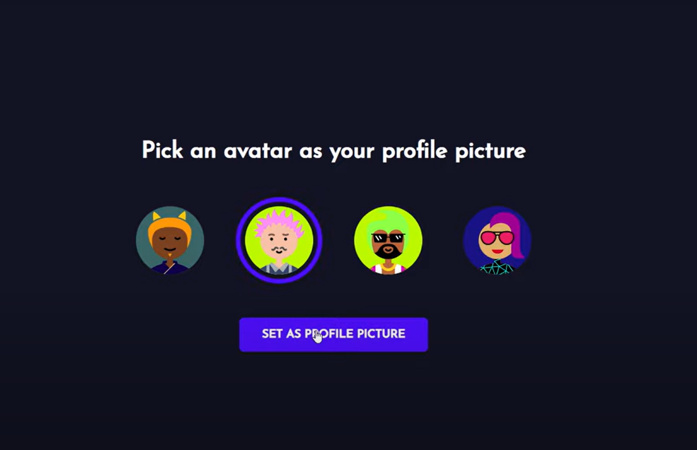

# 💬 ChatWave - Realtime Chat App  

  

**ChatWave** is a full-stack, responsive chat application built with **React, Node.js, Socket.IO, MongoDB, and Express**.  
It leverages **Socket.IO** for real-time communication, enabling users to have seamless, instant conversations.  

---

## ✨ Features  

- ⚡ **Real-time chat**: Instantly send and receive messages  
- 📱 **Responsive design**: Optimized for all devices  
- 🎨 **Styled Components**: Visually appealing and customizable UI  

---

## 🛠️ Technologies Used  

- **React** – Front-end library for building user interfaces  
- **Node.js** – JavaScript runtime for server-side development  
- **Express.js** – Web application framework for Node.js  
- **Socket.IO** – Real-time communication with WebSockets  
- **MongoDB** – NoSQL database for storing chat data  
- **Styled Components** – CSS-in-JS library for styling React components  

---

## ⚙️ Getting Started  

Follow these steps to set up and run **ChatWave** locally:  

### ✅ Prerequisites  
- [Node.js](https://nodejs.org/) installed  
- [MongoDB](https://www.mongodb.com/) installed and running  

### 🔧 Installation  

```bash
# Clone the repository
git clone https://github.com/your-username/chatwave.git  

# Navigate into the project folder
cd chatwave  

# Install dependencies
npm install  

# Start the development server
npm start  

```

## Contact
For any questions or feedback, please reach out to:

📧 **sanjaykunwar24@gmail.com**  
🔗 [LinkedIn – Sanjay Singh Kunwar](https://www.linkedin.com/in/sanjay-kunwar-8a8803320)
